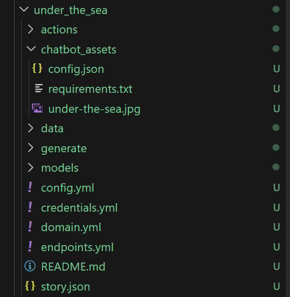

# Preparation for deployment
In order that we can depoy your chatbot **you have to** commit your code into a **git repository** e.g. GitHub or GitLab.  

## Prepare Asset Folder
 1. **create `chatbot_assets` folder in your Chatbot-Challenge-Project**
    * This folder contains the background-image
    * This folder contains the `config.json` file
    * If you need additional Python packages, you can add them to the `requirements.txt` file  
    The structure should look like this:  
    
 
 1. **configure `config.json` file for your project**
    
    chatbot-challenge-frontend/config.js contains the bot configuration. 
    The configuration format is a JSON dictionary.


    example: 
    ```
    {
        "name": "Under the sea",
        "id": "under-the-sea",
        "background-image": "under-the-sea-background-image.jpg",
        "api-url": "http://localhost:5005",
        "welcome-message": "You are under the sea."
    }
    ```


    Here is a list of available configuration parameters:

    | Parameter | Description | Required | Example Value |
    |-----|-----|-----|-----|
    | api_url | URL of the Rasa HTTP API | required | https://vm014.qu.tu-berlin.de/api5005 | 
    | id | Unique ID of the escape room. Please derive this from your team name. | required | under-the-sea | 
    | escape_room_name | Name of the escape room | required | Under the sea | 
    | chatbot_name | Name of the chatbot that is displayed in the chat bubbles. | optional, default is "Game Master" | Neptun | 
    | user_name | Name of the user that is displayed in the chat bubbles | optional, default is "You"| Erika Musterfrau | 
    | messagebox_caption | Caption of the text input box in the chat window. | optional, default is "Type here what you want to do..." | Type here... | 
    | send_button_caption | Caption of the send button in the chat | optional, default="Do" | Swim | 
    | background-image | Name of the background image file in the folder public/background-images/. Please prefix with your id parameter to ensure that the filename is unique. | optional | under-the-sea.jpg | 
    | welcome-message | First message of the chatbot when the user starts the game | optional | You are under the sea." |
 
 1. **if neccessary add additional Python packages to `requirements.txt` file**


     example `requirements.txt` file:
     ```    
        pytest==5.4.3
     ```
     see [requirement-specifiers](https://pip.pypa.io/en/stable/reference/requirement-specifiers/#requirement-specifiers) for more information	


 1. **Check that your current module is uploaded in `models` folder**
    * if not, run `rasa train` and upload the new model
    * **delete old models** in `models` folder, so we save space on the server

 1. **Hints**
   * you do not have to change the API URLS in the `endpoints.yml` file and the `config.yml` file.

